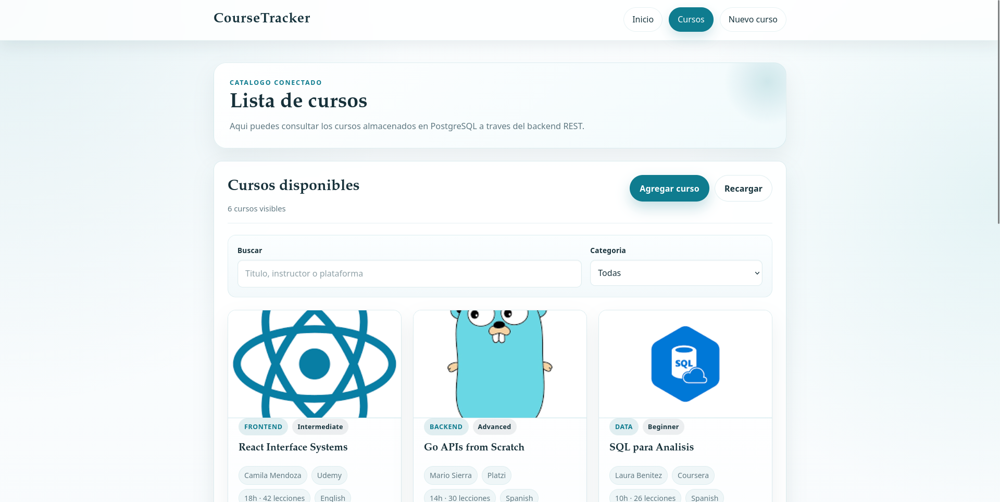

# Courses Tracker Client

Cliente web para **Courses Tracker**, una aplicación full stack separada en frontend y backend.  
Este repositorio contiene únicamente el cliente: **HTML + CSS + JavaScript vanilla**, sin frameworks, sin librerías externas y consumiendo la API con **`fetch()`**.

El enunciado original del laboratorio habla de un *Series Tracker*; en esta implementación el dominio se adaptó a **cursos**, pero se mantuvieron los mismos principios del ejercicio: separación cliente/servidor, consumo REST, CORS, documentación y manejo de imágenes.

## Links

- Frontend desplegado: `https://coursetracker-frontend.vercel.app/`
- Backend desplegado: `https://coursetracker-backend.vercel.app`
- Repositorio del frontend: `https://github.com/PabloVS044/coursetracker-frontend`
- Repositorio del backend: `https://github.com/PabloVS044/coursetracker-backend`

## Screenshot



## Arquitectura

La aplicación está separada en dos repositorios:

- **Frontend**: renderiza la interfaz, escucha eventos del usuario, hace peticiones HTTP y actualiza el DOM.
- **Backend**: expone la API REST, valida entradas y persiste datos en PostgreSQL.

Este cliente:

- **no genera servidor**
- **no accede a la base de datos**
- **no usa server-side rendering**
- **no depende de librerías externas**

## Tecnologías

- HTML
- CSS
- JavaScript vanilla
- Fetch API
- Vercel

## Requisitos Cumplidos

- Cliente hecho con HTML + CSS + JavaScript vanilla
- Consumo de API usando `fetch()`
- Visualización de cursos en interfaz
- Crear cursos desde la interfaz
- Editar cursos desde la interfaz
- Eliminar cursos desde la interfaz
- Soporte visual para imágenes de curso
- Despliegue público en internet
- Repositorio separado del backend

## Challenges Implementados Desde el Frontend

Estos son los challenges del laboratorio que este frontend apoya o implementa directamente:

- Cliente visual completo con varias pantallas
- Consumo de API con búsqueda, paginación lógica y ordenamiento
- Integración visual con Swagger/OpenAPI desde el backend
- Subida de imágenes desde la interfaz usando `fetch()` y `FormData`
- Vista previa local o por URL antes de guardar

## Funcionalidades

- Página de inicio con navegación clara
- Catálogo de cursos conectado al backend
- Filtro de búsqueda por texto
- Filtro por categoría
- Vista de detalle de un curso
- Formulario para crear curso
- Formulario para editar curso
- Eliminación de curso desde lista y detalle
- Vista previa de imagen antes de guardar
- Soporte para backend local y backend desplegado

## Páginas del Cliente

- `index.html`: portada y navegación principal
- `courses.html`: listado de cursos con filtros y acciones
- `course.html`: detalle de un curso
- `form.html`: creación y edición de cursos

## Integración con la API

El cliente consume estas rutas del backend:

- `GET /courses`
- `GET /courses/:courseId`
- `POST /courses`
- `PUT /courses/:courseId`
- `DELETE /courses/:courseId`
- `POST /uploads/image`

La capa que centraliza las peticiones está en [js/store.js](/home/pablo/Documents/Sem5/WD/CourseTracker/coursetracker-frontend/js/store.js:1).

## Configuración del Backend

El frontend decide automáticamente qué backend usar:

- si se abre en local (`localhost`, `127.0.0.1` o `file://`), usa `http://localhost:3000`
- si está desplegado, usa `https://coursetracker-backend.vercel.app`

La lógica vive en [js/config.js](/home/pablo/Documents/Sem5/WD/CourseTracker/coursetracker-frontend/js/config.js:1).

## Override Manual del Backend

Si quieres apuntar temporalmente a otro backend, puedes abrir el frontend con un query param como este:

```text
?apiBaseUrl=http://localhost:3000
```

Ese valor se guarda en `localStorage` para siguientes visitas.

Si quieres volver al comportamiento automático, ejecuta en la consola del navegador:

```js
window.CourseTrackerConfig.resetApiBaseUrlOverride();
location.reload();
```

## CORS

**CORS** es una política de seguridad del navegador que bloquea peticiones entre orígenes distintos si el servidor no las autoriza explícitamente.

En este proyecto, el frontend depende de que el backend permita el origen donde se está ejecutando el cliente.  
Por eso el backend debe incluir el frontend desplegado y también los orígenes locales de desarrollo en `CORS_ORIGIN`.

Ejemplo:

```env
CORS_ORIGIN=https://tu-frontend.vercel.app,http://localhost:5500,http://127.0.0.1:5500
```

## Imágenes

El cliente soporta imágenes de curso de dos formas:

- pegando manualmente una `image_url`
- subiendo un archivo desde el formulario

Cuando se selecciona un archivo:

- el cliente crea una vista previa local
- envía la imagen al backend con `FormData`
- el backend la sube a Cloudinary
- la URL segura resultante se guarda en `image_url`

## Estructura del Proyecto

```text
coursetracker-frontend/
├── css/
│   └── styles.css
├── docs/
│   └── ss.png
├── js/
│   ├── catalog.js
│   ├── config.js
│   ├── detail.js
│   ├── form.js
│   └── store.js
├── course.html
├── courses.html
├── form.html
├── index.html
└── README.md
```

## Organización del Código

- `js/config.js`: decide qué backend usar
- `js/store.js`: centraliza llamadas HTTP, normalización y utilidades
- `js/catalog.js`: lógica del listado de cursos
- `js/detail.js`: lógica del detalle
- `js/form.js`: lógica del formulario, preview y subida de imagen
- `css/styles.css`: estilos globales del sitio

## Cómo Ejecutarlo Localmente

Este frontend es estático, así que no necesita un servidor Node propio.  
Puedes abrirlo de varias maneras:

### Opción 1: Live Server

Abre `index.html` con Live Server desde VS Code o desde tu editor favorito.

### Opción 2: Servidor estático simple

Desde la carpeta `coursetracker-frontend`:

```bash
python3 -m http.server 5500
```

Y luego abre:

```text
http://localhost:5500
```

### Opción 3: Abrir archivo directamente

También puede funcionar abriendo `index.html` con `file://`, ya que el frontend detecta ese caso y apunta al backend local.

## Requisitos Previos para Desarrollo Local

- navegador moderno
- backend corriendo en `http://localhost:3000`

Si el backend no está corriendo, el cliente mostrará mensajes de error indicando la URL que intentó consumir.

## Despliegue

El frontend está pensado para desplegarse como sitio estático, por ejemplo en **Vercel**.

En producción:

- el frontend usa automáticamente `https://coursetracker-backend.vercel.app`
- no requiere variables de entorno para funcionar en el caso actual

Solo debes asegurarte de que el backend desplegado permita tu dominio por CORS.

## Verificación Manual

Con el backend corriendo, deberías poder comprobar:

1. El home carga correctamente
2. La lista de cursos se muestra
3. Puedes crear un curso nuevo
4. Puedes editarlo
5. Puedes eliminarlo
6. La vista de detalle funciona
7. La subida de imagen funciona

## Calidad Visual

La interfaz fue trabajada para que no pareciera una tarea mínima:

- layout claro sobre fondo blanco
- tarjetas y paneles consistentes
- acciones visibles en las cards
- formulario separado por página
- preview de imagen
- navegación simple y legible

## Reflexión Técnica

Sí volvería a usar esta aproximación para proyectos pequeños o laboratorios donde quiera entender bien la relación entre cliente y API. Trabajar solo con JavaScript vanilla obliga a entender mejor el DOM, `fetch()`, eventos, manejo de errores y estructura de archivos sin esconder la complejidad detrás de un framework.

Lo que más me gustó fue que el frontend quedó completamente desacoplado de la base de datos y del servidor, consumiendo únicamente un contrato JSON. También fue útil resolver el cambio entre backend local y backend desplegado sin tener que tocar el código en cada entorno. Lo que más fricción tuvo fue el manejo de CORS y coordinar frontend y backend en distintos ambientes, pero precisamente ese problema hizo que el proyecto se sintiera más real.

## Pendientes Antes de Entregar

- verificar que el screenshot subido sea el correcto
- confirmar que el backend desplegado siga respondiendo bien
- revisar que los links finales del README estén públicos y funcionando
